# Exemples d'algoritmes

## 3-Instruccions bàsiques

### Exemple 3-1

**Enunciat**: Determinar la hipotenusa d'un triangle rectangle conegudes les longituds dels seus dos catets.

::: tabs
== Pseudocodi

```
Inici
    Inicialitzar CatA = 0, CatB = 0
    Llegir CatA, CatB
    Calcular Hip = sqrt(CatA^2 + CatB^2)
    Escriure Hipotenusa
Fi
```

== Diagrama de flux

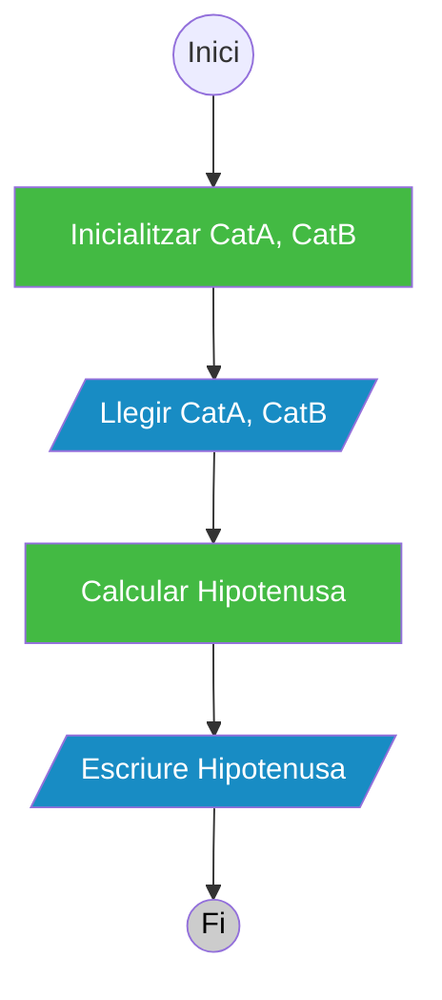
```mermaid

 graph TD;
    A((Inici)) --> B[Inicialitzar CatA, CatB]:::rectangle;
    B --> C[/Llegir CatA, CatB/]:::romboide;
    C --> D[Calcular Hipotenusa]:::rectangle;
    D --> E[/Escriure Hipotenusa/]:::romboide;
    E --> F((Fi)):::inici_fi;

    classDef romboide fill:#188CC4, color:white;
    classDef rombo fill:#A08DB1, color:white;
    classDef rectangle fill:#43BA43, color:white;
    classDef inici_fi fill:#ccc, color:#000;
```

:::

### Exemple 3-2

**Enunciat**: Desenvolupeu un algorisme que permeta determinar l’àrea i el volum d’un cilindre donat el seu radi (R) i altura (H).

::: tabs
== Pseudocodi

```
Inici
    Inicialitzar R = 0, H = 0
    Llegir R, H
    Calcular Volum = pi * R^2 * H
    Calcular Àrea = 2 * pi * R * (R + H)
    Escriure Àrea, Volum
Fi
```

== Diagrama de flux

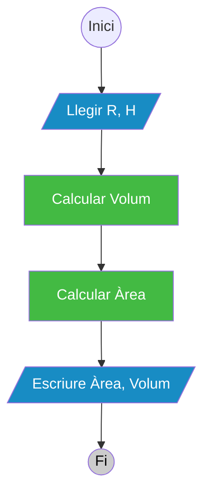
```mermaid
 graph TD;
    A((Inici)) --> B[/Llegir R, H/]:::romboide;
    B --> C[Calcular Volum]:::rectangle;
    C --> D[Calcular Àrea]:::rectangle;
    D --> E[/Escriure Àrea, Volum/]:::romboide;
    E --> F((Fi)):::inici_fi;

    classDef romboide fill:#188CC4, color:white;
    classDef rombo fill:#A08DB1, color:white;
    classDef rectangle fill:#43BA43, color:white;
    classDef inici_fi fill:#ccc, color:#000;
```

:::

### Exemple 3-3

**Enunciat**: Realitzeu un algorisme que, a partir de proporcionar-li la velocitat d'un automòbil en quilòmetres per hora, calcule la velocitat en metres per segon.

::: tabs
== Pseudocodi

```
Inici
    Llegir VelocitatKmH
    Calcular VelocitatMs = (VelocitatKmH * 1000) / 3600
    Escriure VelocitatMs
Fi
```

== Diagrama de flux

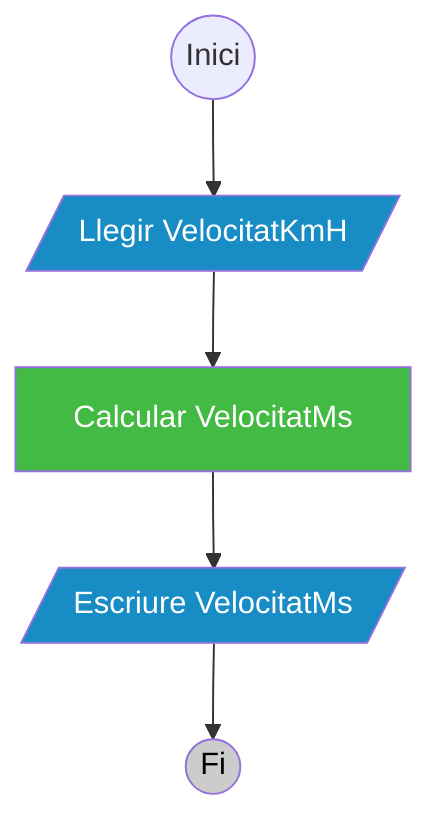
```mermaid
 graph TD;
    A((Inici)) --> B[/Llegir VelocitatKmH/]:::romboide;
    B --> C[Calcular VelocitatMs]:::rectangle;
    C --> D[/Escriure VelocitatMs/]:::romboide;
    D --> E((Fi)):::inici_fi;

    classDef romboide fill:#188CC4, color:white;
    classDef rombo fill:#A08DB1, color:white;
    classDef rectangle fill:#43BA43, color:white;
    classDef inici_fi fill:#ccc, color:#000;
```

:::


## 4-1 Estructura Alternativa Simple

### Exemple 4-1-1

**Enunciat**: Desenvolupeu un algorisme que permeta determinar si un estudiant ha aprovat en funció de la nota introduïda. Si la nota és superior o igual a 5, el sistema haurà d'indicar que l'estudiant ha aprovat.

::: tabs
== Pseudocodi

```
Inici
  Llegir nota
  Si nota >= 5 Llavors
    Escriure "Aprovat"
  Fi_Si
Fi
```

== Diagrama de flux

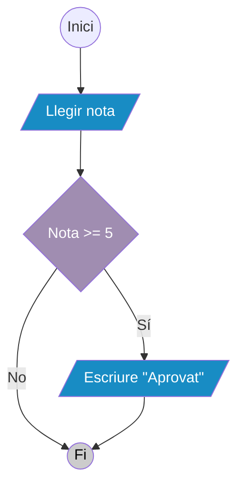
```mermaid
graph TD;
    A((Inici)) --> B[/Llegir nota/]:::romboide;
    B --> C{Nota >= 5}:::rombo;
    C -->|Sí| D[/Escriure "Aprovat"/]:::romboide;
    C -->|No| E((Fi)):::inici_fi;
    D --> E;

    classDef romboide fill:#188CC4, color:white;
    classDef rombo fill:#A08DB1, color:white;
    classDef inici_fi fill:#ccc, color:#000;
```

:::

### Exemple 4-1-2

**Enunciat**: Desenvolupeu un algorisme que permeta determinar si una persona és major d'edat en funció de l'edat introduïda. Si l'edat és superior o igual a 18, el sistema haurà d'indicar que la persona és major d'edat.

::: tabs
== Pseudocodi

```
Inici
  Llegir edat
  Si edat >= 18 Llavors
    Escriure "És major d'edat"
  Fi_Si
Fi
```

== Diagrama de flux

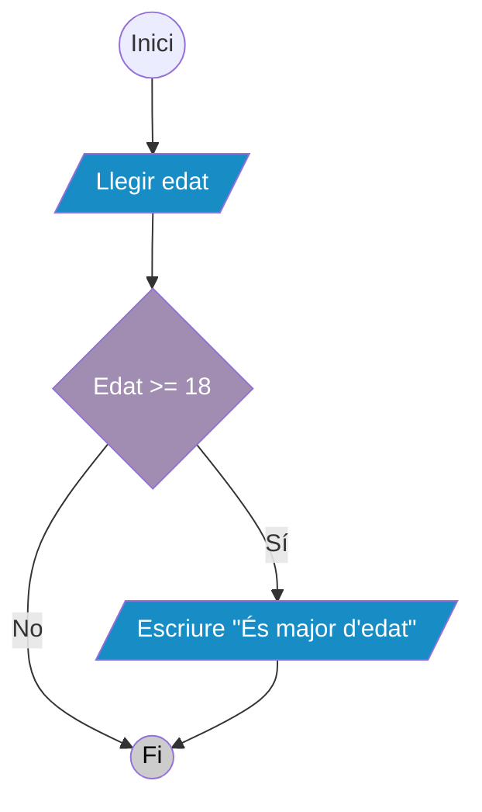
```mermaid
graph TD;
    A((Inici)) --> B[/Llegir edat/]:::romboide;
    B --> C{Edat >= 18}:::rombo;
    C -->|Sí| D[/Escriure "És major d'edat"/]:::romboide;
    C -->|No| E((Fi)):::inici_fi;
    D --> E;

    classDef romboide fill:#188CC4, color:white;
    classDef rombo fill:#A08DB1, color:white;
    classDef inici_fi fill:#ccc, color:#000;
```

:::

### Exemple 4-1-3

**Enunciat**: Desenvolupeu un algorisme que permeta llegir dos números i ordenar-los de menor a major.

::: tabs
== Pseudocodi

```
Inici
    Llegir A, B
    Si A > B Llavors
        Temporal = A
        A = B
        B = Temporal
    Fi_Si
    Escriure "Ordre:", A, B
Fi
```

== Diagrama de flux

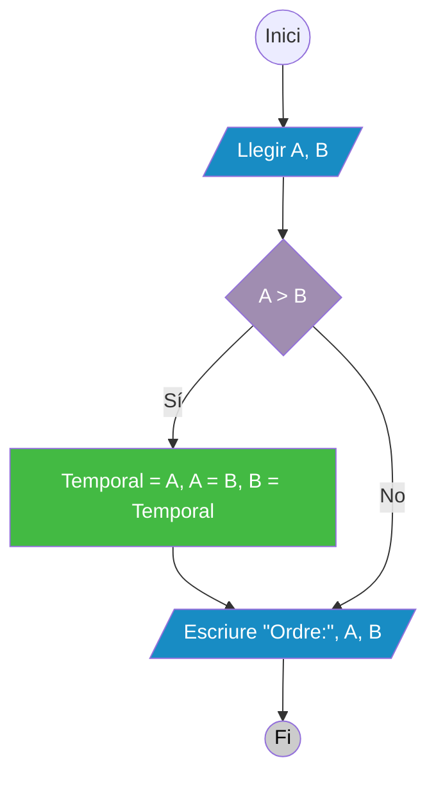
```mermaid
 graph TD;
    A((Inici)) --> B[/Llegir A, B/]:::romboide;
    B --> C{A > B}:::rombo;
    C -->|Sí| D[Temporal = A, A = B, B = Temporal]:::rectangle;
    D --> E[/Escriure "Ordre:", A, B/]:::romboide;
    C -->|No| E;
    E --> F((Fi)):::inici_fi;

    classDef romboide fill:#188CC4, color:white;
    classDef rombo fill:#A08DB1, color:white;
    classDef rectangle fill:#43BA43, color:white;
    classDef inici_fi fill:#ccc, color:#000;
```

:::

## 4-2 Estructura Alternativa Doble

### Exemple 4-2-1

**Enunciat**: Desenvolupeu un algorisme que permeta determinar si una persona té febre en funció de la temperatura introduïda. Si la temperatura és superior a 37 graus, el sistema haurà d'indicar que la persona té febre; en cas contrari, indicarà que la temperatura és normal.

::: tabs
== Pseudocodi

```
Inici
  Llegir temperatura
  Si temperatura > 37 Llavors
    Escriure "Febre"
  Si no
    Escriure "Temperatura normal"
  Fi_Si
Fi
```

== Diagrama de flux

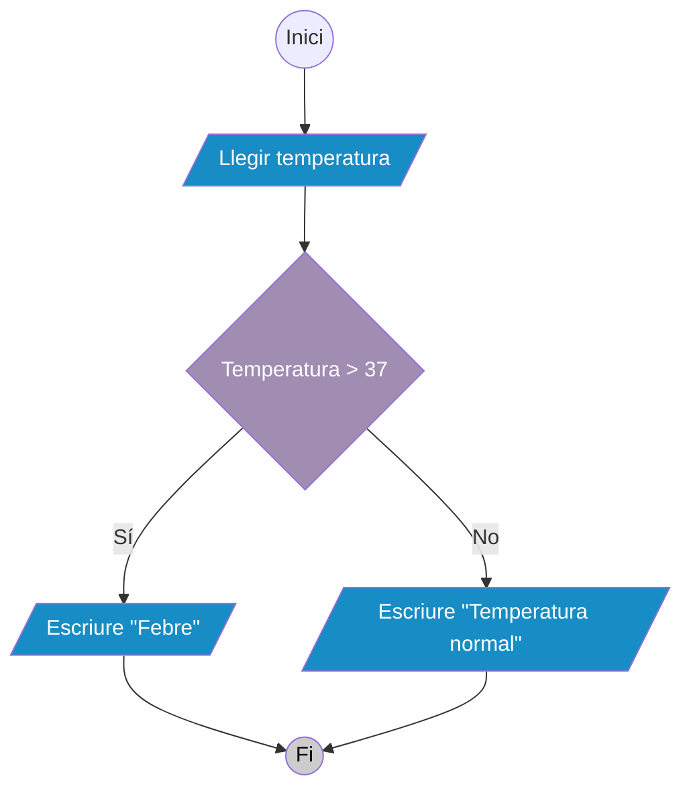
```mermaid
graph TD;
    A((Inici)) --> B[/Llegir temperatura/]:::romboide;
    B --> C{Temperatura > 37}:::rombo;
    C -->|Sí| D[/Escriure "Febre"/]:::romboide;
    C -->|No| E[/Escriure "Temperatura normal"/]:::romboide;
    D --> F((Fi)):::inici_fi;
    E --> F;

    classDef romboide fill:#188CC4, color:white;
    classDef rombo fill:#A08DB1, color:white;
    classDef inici_fi fill:#ccc, color:#000;
```

:::

### Exemple 4-2-2

**Enunciat**: Desenvolupeu un algorisme que permeta determinar si un valor és positiu o negatiu. Si el valor introduït és igual o major que 0, el sistema indicarà que és positiu; en cas contrari, indicarà que és negatiu.

::: tabs
== Pseudocodi

```
Inici
  Llegir valor
  Si valor >= 0 Llavors
    Escriure "És positiu"
  Si no
    Escriure "És negatiu"
  Fi_Si
Fi
```

== Diagrama de flux

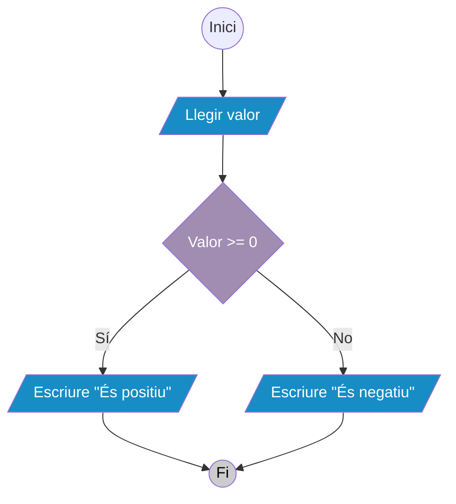
```mermaid
graph TD;
    A((Inici)) --> B[/Llegir valor/]:::romboide;
    B --> C{Valor >= 0}:::rombo;
    C -->|Sí| D[/Escriure "És positiu"/]:::romboide;
    C -->|No| E[/Escriure "És negatiu"/]:::romboide;
    D --> F((Fi)):::inici_fi;
    E --> F;

    classDef romboide fill:#188CC4, color:white;
    classDef rombo fill:#A08DB1, color:white;
    classDef inici_fi fill:#ccc, color:#000;
```

:::

### Exemple 4-2-3

**Enunciat**: Desenvolupeu un algorisme que permeta llegir dos valors diferents, determinar quin dels dos valors és el major i escriure’l.

::: tabs
== Pseudocodi

```
Inici
    Inicialitzar variables: A = 0, B = 0
    Sol·licitar dos valors diferents
    Llegir A, B
    Si A > B Llavors
        Escriure A, "és el major"
    Si no
        Escriure B, "és el major"
    Fi_Si
Fi
```

== Diagrama de flux

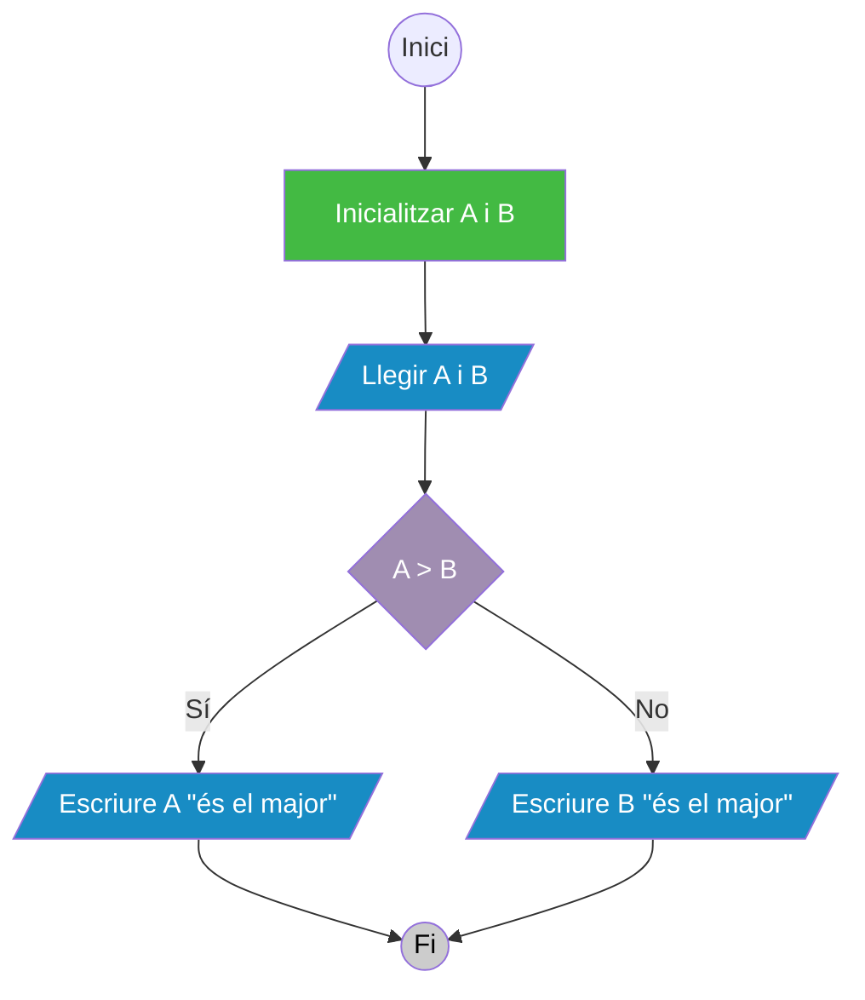
```mermaid
 graph TD;
    A((Inici)) --> B[Inicialitzar A i B]:::rectangle;
    B --> C[/Llegir A i B/]:::romboide;
    C -->E{A > B}:::rombo;
    E -->|Sí| F[/Escriure A "és el major"/]:::romboide;
    E -->|No| G[/Escriure B "és el major"/]:::romboide;
    F --> H((Fi)):::inici_fi;
    G --> H;
    
    classDef romboide fill:#188CC4, color:white;
    classDef rombo fill:#A08DB1, color:white;
    classDef rectangle fill:#43BA43, color:white;
    classDef inici_fi fill:#ccc, color:#000;
```

:::

### Exemple 4-2-4

**Enunciat**: Desenvolupeu un algorisme que permeta llegir un valor qualsevol N i escriure si aquest número és parell o senar.

::: tabs
== Pseudocodi

```
Inici
    Llegir N
    Si N % 2 = 0 Llavors
        Escriure "És parell"
    Si no
        Escriure "És senar"
    Fi_Si
Fi
```

== Diagrama de flux

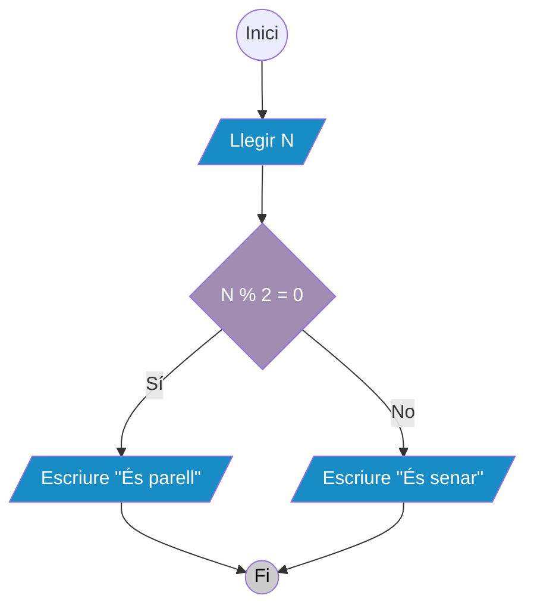
```mermaid
 graph TD;
    A((Inici)) --> B[/Llegir N/]:::romboide;
    B --> C{N % 2 = 0}:::rombo;
    C -->|Sí| D[/Escriure "És parell"/]:::romboide;
    C -->|No| E[/Escriure "És senar"/]:::romboide;
    D --> F((Fi)):::inici_fi;
    E --> F;

    classDef romboide fill:#188CC4, color:white;
    classDef rombo fill:#A08DB1, color:white;
    classDef rectangle fill:#43BA43, color:white;
    classDef inici_fi fill:#ccc, color:#000;
```

:::

## 4-3 Concatenació de sentències condicionales

### Exemple 4-3-1

**Enunciat**: Desenvolupeu un algorisme que permeta classificar una persona segons la seua edat. Si la persona té menys de 12 anys, es classificarà com a "Infantil". Si té entre 12 i 18 anys (ambdós inclosos), es classificarà com a "Adolescent". Si té més de 18 anys, es classificarà com a "Adult".

::: tabs
== Pseudocodi

```
Inici
  Llegir edat
  Si edat < 12 Llavors
    Escriure "Infantil"
  Si no Si edat <= 18 Llavors
    Escriure "Adolescent"
  Si no
    Escriure "Adult"
  Fi_Si
Fi
```

== Diagrama de flux

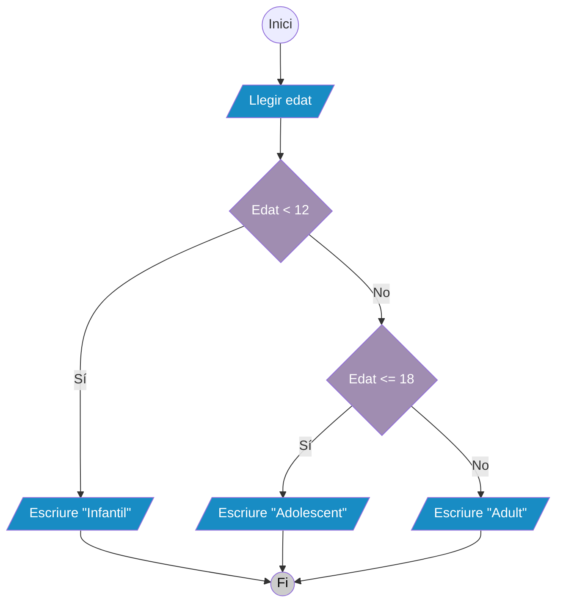
```mermaid
graph TD;
    A((Inici)) --> B[/Llegir edat/]:::romboide;
    B --> C{Edat < 12}:::rombo;
    C -->|Sí| D[/Escriure "Infantil"/]:::romboide;
    C -->|No| E{Edat <= 18}:::rombo;
    E -->|Sí| F[/Escriure "Adolescent"/]:::romboide;
    E -->|No| G[/Escriure "Adult"/]:::romboide;
    D --> H((Fi)):::inici_fi;
    F --> H;
    G --> H;

    classDef romboide fill:#188CC4, color:white;
    classDef rombo fill:#A08DB1, color:white;
    classDef inici_fi fill:#ccc, color:#000;
```

:::

### Exemple 4-3-2

**Enunciat**: Desenvolupeu un algorisme que permeta classificar una nota segons la seua puntuació. Si la nota és 9 o superior, es considerarà "Excel·lent". Si és entre 7 i 8, es classificarà com a "Notable". Si és entre 5 i 6, serà "Aprovat". Si és inferior a 5, serà "Suspès".

::: tabs
== Pseudocodi

```
Inici
  Llegir nota
  Si nota >= 9 Llavors
    Escriure "Excel·lent"
  Si no Si nota >= 7 Llavors
    Escriure "Notable"
  Si no Si nota >= 5 Llavors
    Escriure "Aprovat"
  Si no
    Escriure "Suspès"
  Fi_Si
Fi
```

== Diagrama de flux

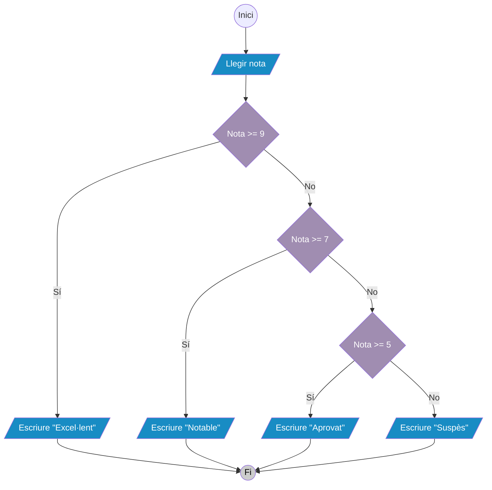
```mermaid
graph TD;
    A((Inici)) --> B[/Llegir nota/]:::romboide;
    B --> C{Nota >= 9}:::rombo;
    C -->|Sí| D[/Escriure "Excel·lent"/]:::romboide;
    C -->|No| E{Nota >= 7}:::rombo;
    E -->|Sí| F[/Escriure "Notable"/]:::romboide;
    E -->|No| G{Nota >= 5}:::rombo;
    G -->|Sí| H[/Escriure "Aprovat"/]:::romboide;
    G -->|No| I[/Escriure "Suspès"/]:::romboide;
    D --> J((Fi)):::inici_fi;
    F --> J;
    H --> J;
    I --> J;

    classDef romboide fill:#188CC4, color:white;
    classDef rombo fill:#A08DB1, color:white;
    classDef inici_fi fill:#ccc, color:#000;
```

:::

### Exemple 4-3-3

**Enunciat**: Desenvolupeu un algorisme que permeta llegir tres valors i emmagatzemar-los en les variables A, B i C respectivament. L'algorisme ha d'imprimir quin és el major i quin és el menor. Els tres valors han de ser diferents.

::: tabs
== Pseudocodi

```
Inici
    Inicialitzar A, B, C
    Llegir A, B, C
    Si A > B i A > C Llavors
        Escriure A, "és el major"
    Si no Si B > A i B > C Llavors
        Escriure B, "és el major"
    Si no
        Escriure C, "és el major"
    Fi_Si
Fi
```

== Diagrama de flux

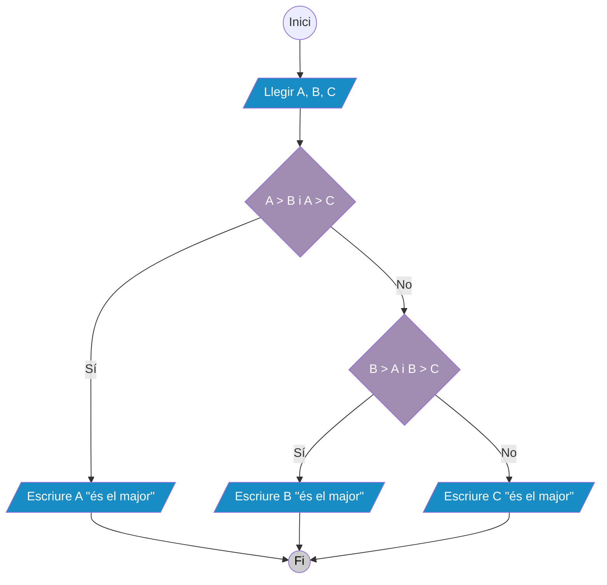
```mermaid
 graph TD;
    A((Inici)) --> B[/Llegir A, B, C/]:::romboide;
    B --> C{A > B i A > C}:::rombo;
    C -->|Sí| D[/Escriure A "és el major"/]:::romboide;
    C -->|No| E{B > A i B > C}:::rombo;
    E -->|Sí| F[/Escriure B "és el major"/]:::romboide;
    E -->|No| G[/Escriure C "és el major"/]:::romboide;
    D --> H((Fi)):::inici_fi;
    F --> H;
    G --> H;

    classDef romboide fill:#188CC4, color:white;
    classDef rombo fill:#A08DB1, color:white;
    classDef rectangle fill:#43BA43, color:white;
    classDef inici_fi fill:#ccc, color:#000;
```

:::

### Exemple 4-3-4

**Enunciat**: Desenvolupeu un algorisme que permeta convertir qualificacions numèriques segons la següent taula: A = 19 i 20, B = 16, 17 i 18, C = 13, 14 i 15, D = 10, 11 i 12, E = 1 fins al 9.

::: tabs
== Pseudocodi

```
Inici
    Llegir Nota
    Si Nota >= 19 i Nota <= 20 Llavors
        Escriure "A"
    Si no Si Nota >= 16 i Nota <= 18 Llavors
        Escriure "B"
    Si no Si Nota >= 13 i Nota <= 15 Llavors
        Escriure "C"
    Si no Si Nota >= 10 i Nota <= 12 Llavors
        Escriure "D"
    Si no Si Nota >= 1 i Nota <= 9 Llavors
        Escriure "E"
    Fi_Si
Fi
```

== Diagrama de flux

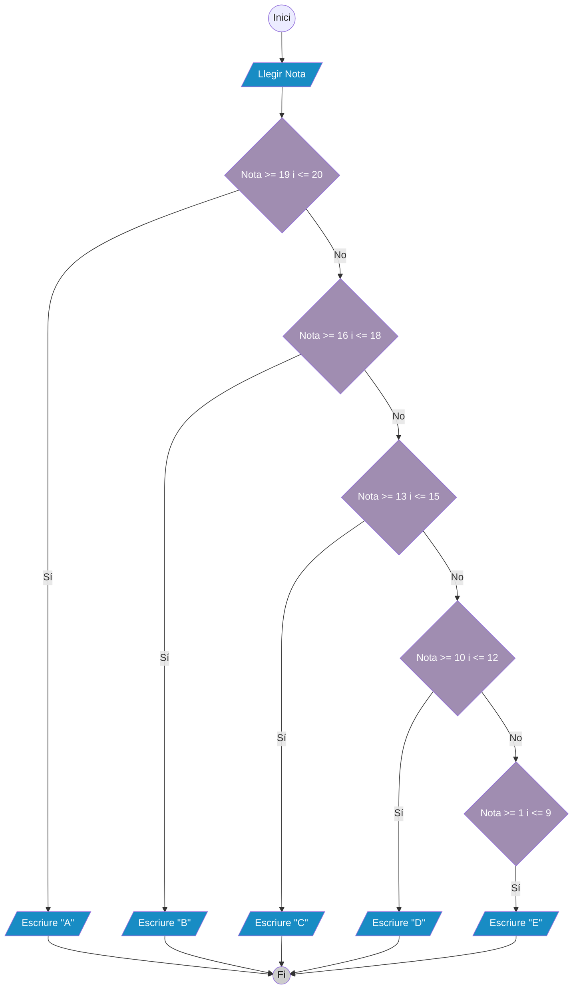
```mermaid
 graph TD;
    A((Inici)) --> B[/Llegir Nota/]:::romboide;
    B --> C{Nota >= 19 i <= 20}:::rombo;
    C -->|Sí| D[/Escriure "A"/]:::romboide;
    C -->|No| E{Nota >= 16 i <= 18}:::rombo;
    E -->|Sí| F[/Escriure "B"/]:::romboide;
    E -->|No| G{Nota >= 13 i <= 15}:::rombo;
    G -->|Sí| H[/Escriure "C"/]:::romboide;
    G -->|No| I{Nota >= 10 i <= 12}:::rombo;
    I -->|Sí| J[/Escriure "D"/]:::romboide;
    I -->|No| K{Nota >= 1 i <= 9}:::rombo;
    K -->|Sí| L[/Escriure "E"/]:::romboide;
    D --> M((Fi)):::inici_fi;
    F --> M;
    H --> M;
    J --> M;
    L --> M;

    classDef romboide fill:#188CC4, color:white;
    classDef rombo fill:#A08DB1, color:white;
    classDef rectangle fill:#43BA43, color:white;
    classDef inici_fi fill:#ccc, color:#000;
```

:::

## 4-4 Estructura Alternativa Múltiple (Switch)

### Exemple 4-4-1

**Enunciat**: Desenvolupeu un algorisme que, donat un número entre 1 i 7, escriga el nom del dia de la setmana corresponent. Si el valor no es troba entre 1 i 7, s'ha de mostrar "Dia no vàlid".

::: tabs
== Pseudocodi

```
Inici
  Llegir dia_setmana
  Segons (dia_setmana)
    Cas 1: Escriure "Dilluns"
    Cas 2: Escriure "Dimarts"
    Cas 3: Escriure "Dimecres"
    Cas 4: Escriure "Dijous"
    Cas 5: Escriure "Divendres"
    Cas 6: Escriure "Dissabte"
    Cas 7: Escriure "Diumenge"
    Altrament: Escriure "Dia no vàlid"
  Fi_Segons
Fi
```

== Diagrama de flux

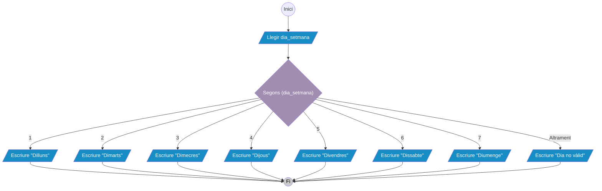
```mermaid
graph TD;
    A((Inici)) --> B[/Llegir dia_setmana/]:::romboide;
    B --> C{"Segons (dia_setmana)"}:::rombo;
    C -->|1| D[/Escriure "Dilluns"/]:::romboide;
    C -->|2| E[/Escriure "Dimarts"/]:::romboide;
    C -->|3| F[/Escriure "Dimecres"/]:::romboide;
    C -->|4| G[/Escriure "Dijous"/]:::romboide;
    C -->|5| H[/Escriure "Divendres"/]:::romboide;
    C -->|6| I[/Escriure "Dissabte"/]:::romboide;
    C -->|7| J[/Escriure "Diumenge"/]:::romboide;
    C -->|Altrament| K[/Escriure "Dia no vàlid"/]:::romboide;
    D --> L((Fi)):::inici_fi;
    E --> L;
    F --> L;
    G --> L;
    H --> L;
    I --> L;
    J --> L;
    K --> L;

    classDef romboide fill:#188CC4, color:white;
    classDef rombo fill:#A08DB1, color:white;
    classDef inici_fi fill:#ccc, color:#000;
```

:::

### Exemple 4-4-2

**Enunciat**: Desenvolupeu un algorisme que, donat un número entre 1 i 12 que representa un mes, escriga l'estació de l'any corresponent. Si el valor no es troba entre 1 i 12, s'ha de mostrar "Mes no vàlid".

::: tabs
== Pseudocodi

```
Inici
  Llegir mes
  Segons (mes)
    Cas 12, 1, 2: Escriure "Hivern"
    Cas 3, 4, 5: Escriure "Primavera"
    Cas 6, 7, 8: Escriure "Estiu"
    Cas 9, 10, 11: Escriure "Tardor"
    Altrament: Escriure "Mes no vàlid"
  Fi_Segons
Fi
```

== Diagrama de flux

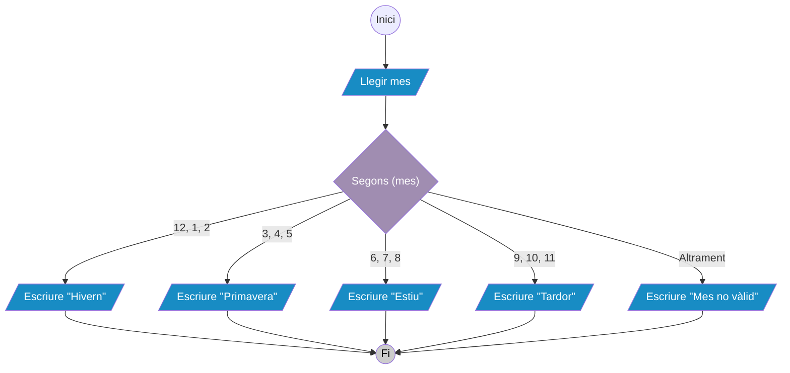
```mermaid
graph TD;
    A((Inici)) --> B[/Llegir mes/]:::romboide;
    B --> C{"Segons (mes)"}:::rombo;
    C -->|12, 1, 2| D[/Escriure "Hivern"/]:::romboide;
    C -->|3, 4, 5| E[/Escriure "Primavera"/]:::romboide;
    C -->|6, 7, 8| F[/Escriure "Estiu"/]:::romboide;
    C -->|9, 10, 11| G[/Escriure "Tardor"/]:::romboide;
    C -->|Altrament| H[/Escriure "Mes no vàlid"/]:::romboide;
    D --> I((Fi)):::inici_fi;
    E --> I;
    F --> I;
    G --> I;
    H --> I;

    classDef romboide fill:#188CC4, color:white;
    classDef rombo fill:#A08DB1, color:white;
    classDef inici_fi fill:#ccc, color:#000;
```

:::

## 4-5 Estructura Mentre (WHILE)

### Exemple 4-5-1

**Enunciat**: Desenvolupeu un algorisme que mostri els nombres del 1 al 10. Utilitzeu una estructura de bucle per a incrementar un comptador i mostrar el seu valor en cada iteració.

::: tabs
== Pseudocodi

```
Inici
  Inicialitzar N = 1
  Mentre N <= 10 Fer
    Escriure N
    N = N + 1
  Fi_Mentre
Fi
```

== Diagrama de flux

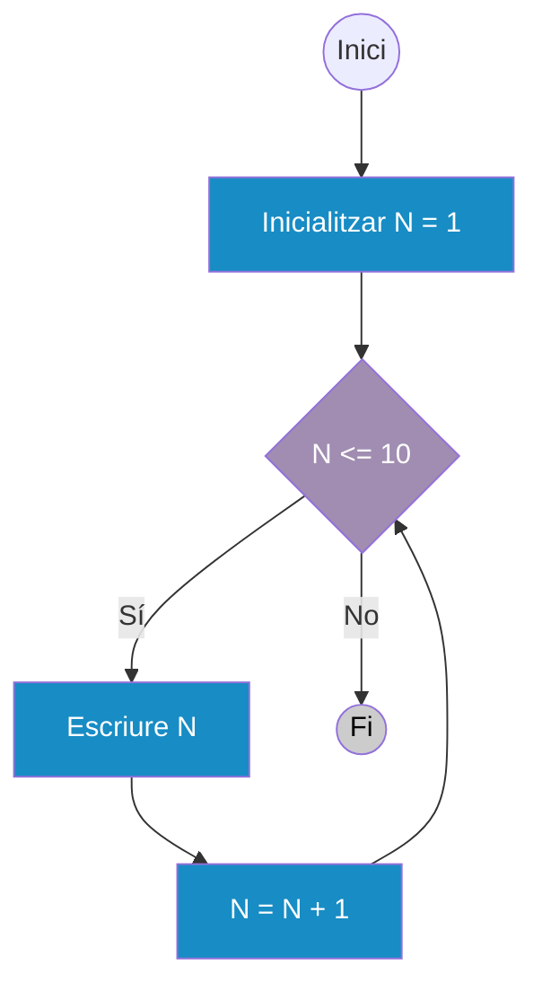
```mermaid
graph TD;
    A((Inici)) --> B[Inicialitzar N = 1]:::romboide;
    B --> C{N <= 10}:::rombo;
    C -->|Sí| D[Escriure N]:::romboide;
    D --> E[N = N + 1]:::romboide;
    E --> C;
    C -->|No| F((Fi)):::inici_fi;

    classDef romboide fill:#188CC4, color:white;
    classDef rombo fill:#A08DB1, color:white;
    classDef inici_fi fill:#ccc, color:#000;
```

:::

### Exemple 4-5-2

**Enunciat**: Desenvolupeu un algorisme que demani una contrasenya i mostri un missatge d'error fins que s'introdueixi la contrasenya correcta, que en aquest cas serà "1234".

::: tabs
== Pseudocodi

```
Inici
  Llegir contrasenya
  Mentre contrasenya != "1234" Fer
    Escriure "Contrasenya incorrecta"
    Llegir contrasenya
  Fi_Mentre
  Escriure "Contrasenya correcta"
Fi
```

== Diagrama de flux

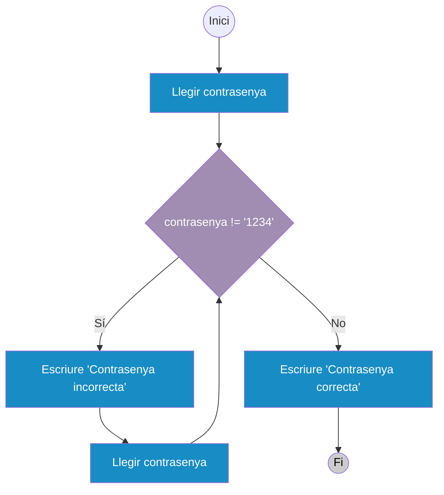
```mermaid
graph TD;
    A((Inici)) --> B[Llegir contrasenya]:::romboide;
    B --> C{"contrasenya != '1234'"}:::rombo;
    C -->|Sí| D[Escriure 'Contrasenya incorrecta']:::romboide;
    D --> E[Llegir contrasenya]:::romboide;
    E --> C;
    C -->|No| F[Escriure 'Contrasenya correcta']:::romboide;
    F --> G((Fi)):::inici_fi;

    classDef romboide fill:#188CC4, color:white;
    classDef rombo fill:#A08DB1, color:white;
    classDef inici_fi fill:#ccc, color:#000;
```

:::

### Exemple 4-5-3

**Enunciat**: Desenvolupeu un algorisme que permeta llegir un valor enter positiu N i determinar si és primer o no.

::: tabs
== Pseudocodi

```
Inici
    Llegir N
    Inicialitzar J = 2, S = 0
    Mentre J <= N / 2 Fer
        Si N % J = 0 Llavors
            S = S + 1
        Fi_Si
        J = J + 1
    Fi_Mentre
    Si S = 0 Llavors
        Escriure N, "és primer"
    Si no
        Escriure N, "no és primer"
    Fi_Si
Fi
```

== Diagrama de flux

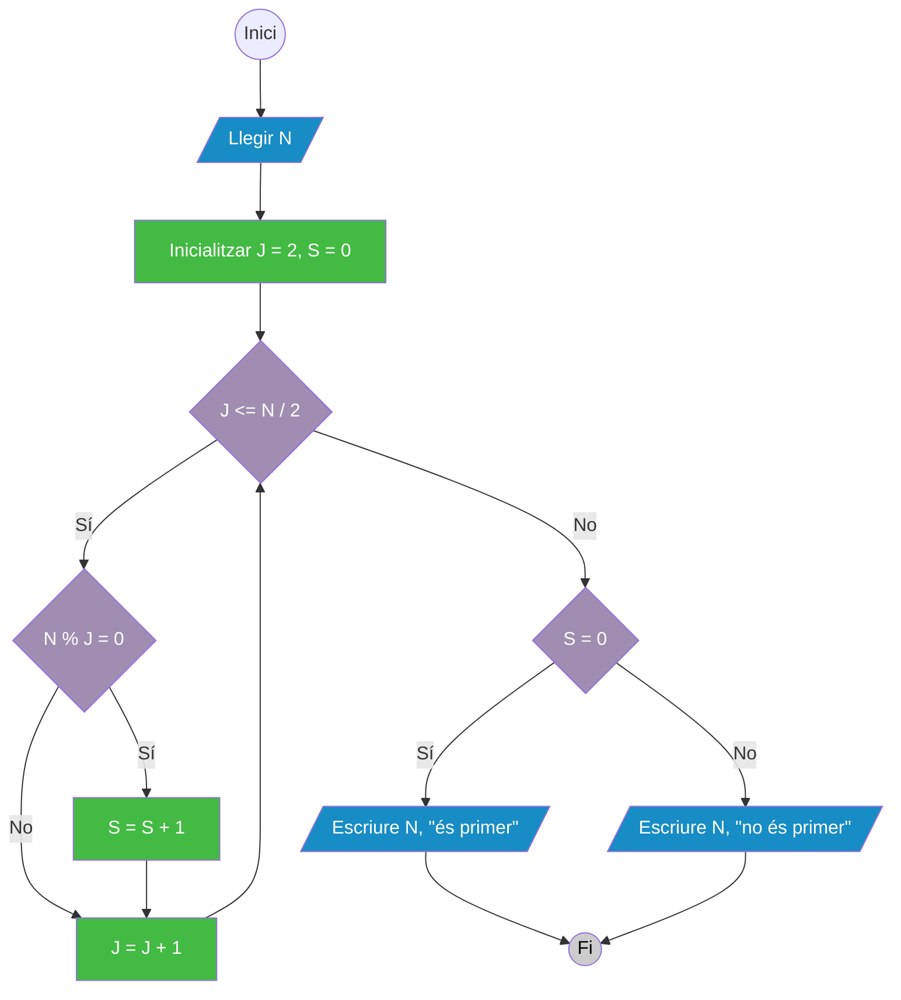
```mermaid
 graph TD;
    A((Inici)) --> B[/Llegir N/]:::romboide;
    B --> C[Inicialitzar J = 2, S = 0]:::rectangle;
    C --> D{J <= N / 2}:::rombo;
    D -->|Sí| E{N % J = 0}:::rombo;
    E -->|Sí| F[S = S + 1]:::rectangle;
    E -->|No| G[J = J + 1]:::rectangle;
    F --> G;
    G --> D;
    D -->|No| H{S = 0}:::rombo;
    H -->|Sí| I[/Escriure N, "és primer"/]:::romboide;
    H -->|No| J[/Escriure N, "no és primer"/]:::romboide;
    I --> K((Fi)):::inici_fi;
    J --> K;

    classDef romboide fill:#188CC4, color:white;
    classDef rombo fill:#A08DB1, color:white;
    classDef rectangle fill:#43BA43, color:white;
    classDef inici_fi fill:#ccc, color:#000;
```

:::

### Exemple 4-5-4

**Enunciat**: Desenvolupeu un algorisme que permeta convertir un número de dies en anys, mesos, setmanes i dies.

::: tabs
== Pseudocodi

```
Inici
    Llegir NumDies
    Inicialitzar Anys = 0, Mesos = 0, Setmanes = 0, Dies = 0
    Mentre NumDies >= 365 Fer
        Anys = Anys + 1
        NumDies = NumDies - 365
    Fi_Mentre
    Mentre NumDies >= 30 Fer
        Mesos = Mesos + 1
        NumDies = NumDies - 30
    Fi_Mentre
    Mentre NumDies >= 7 Fer
        Setmanes = Setmanes + 1
        NumDies = NumDies - 7
    Fi_Mentre
    Dies = NumDies
    Escriure Anys, "anys", Mesos, "mesos", Setmanes, "setmanes", Dies, "dies"
Fi
```

== Diagrama de flux

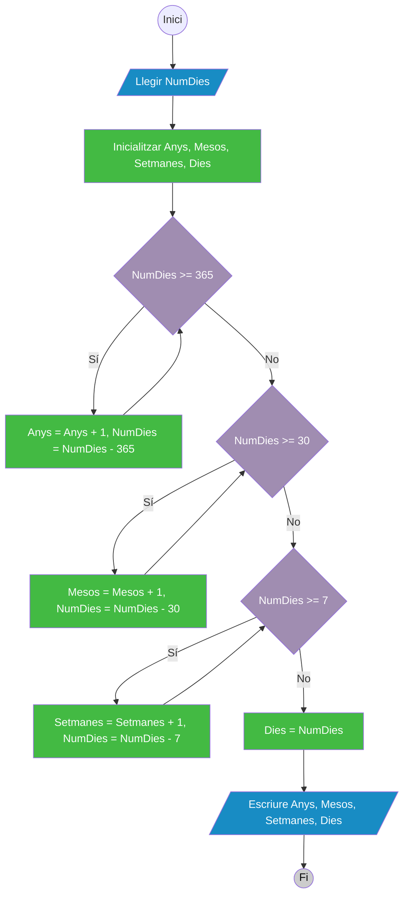
```mermaid
  graph TD;
    A((Inici)) --> B[/Llegir NumDies/]:::romboide;
    B --> C[Inicialitzar Anys, Mesos, Setmanes, Dies]:::rectangle;
    C --> D{NumDies >= 365}:::rombo;
    D -->|Sí| E[Anys = Anys + 1, NumDies = NumDies - 365]:::rectangle;
    E --> D;
    D -->|No| F{NumDies >= 30}:::rombo;
    F -->|Sí| G[Mesos = Mesos + 1, NumDies = NumDies - 30]:::rectangle;
    G --> F;
    F -->|No| H{NumDies >= 7}:::rombo;
    H -->|Sí| I[Setmanes = Setmanes + 1, NumDies = NumDies - 7]:::rectangle;
    I --> H;
    H -->|No| J[Dies = NumDies]:::rectangle;
    J --> K[/Escriure Anys, Mesos, Setmanes, Dies/]:::romboide;
    K --> L((Fi)):::inici_fi;

    classDef romboide fill:#188CC4, color:white;
    classDef rombo fill:#A08DB1, color:white;
    classDef rectangle fill:#43BA43, color:white;
    classDef inici_fi fill:#ccc, color:#000;
```

:::

## 4-6 Estructura Fins que (DO-WHILE)

### Exemple 4-6-1

**Enunciat**: Desenvolupeu un algorisme que demani a l'usuari un número i l'escrigui. Això es repetirà fins que l'usuari introdueixi un número igual a 0.

::: tabs
== Pseudocodi

```
Inici
  Fer
    Llegir número
    Escriure número
  Fins que número = 0
Fi
```

== Diagrama de flux

```mermaid
graph TD;
    A((Inici)) --> B[Llegir número]:::romboide;
    B --> C[Escriure número]:::romboide;
    C --> D{número = 0}:::rombo;
    D -->|No| B;
    D -->|Sí| E((Fi)):::inici_fi;

    classDef romboide fill:#188CC4, color:white;
    classDef rombo fill:#A08DB1, color:white;
    classDef inici_fi fill:#ccc, color:#000;
```

:::

### Exemple 4-6-2

**Enunciat**: Desenvolupeu un algorisme que demani a l'usuari un número major o igual a 18. Això es repetirà fins que l'usuari escriga un número que complisca la condició.

::: tabs
== Pseudocodi

```
Inici
  Fer
    Llegir edat
    Escriure edat
  Fins que edat >= 18
Fi
```

== Diagrama de flux

```mermaid
graph TD;
    A((Inici)) --> B[Llegir edat]:::romboide;
    B --> C[Escriure edat]:::romboide;
    C --> D{edat >= 18}:::rombo;
    D -->|No| B;
    D -->|Sí| E((Fi)):::inici_fi;

    classDef romboide fill:#188CC4, color:white;
    classDef rombo fill:#A08DB1, color:white;
    classDef inici_fi fill:#ccc, color:#000;
```

:::

## 4-7 Estructura Per (FOR)

### Exemple 4-7-1

**Enunciat**: Desenvolupeu un algorisme que imprimeixi els números de l'1 al 10 utilitzant un bucle per.

::: tabs
== Pseudocodi

```
Inici
  Per i = 1 fins a 10 Fer
    Escriure i
  Fi_Per
Fi
```

== Diagrama de flux

```mermaid
graph TD;
    A((Inici)) --> B[Inicialitzar i = 1]:::romboide;
    B --> C{i <= 10}:::rombo;
    C -->|Sí| D[Escriure i]:::romboide;
    D --> E[Nova iteració: i = i + 1]:::romboide;
    E --> B;
    C -->|No| F((Fi)):::inici_fi;

    classDef romboide fill:#188CC4, color:white;
    classDef rombo fill:#A08DB1, color:white;
    classDef inici_fi fill:#ccc, color:#000;
```

:::

### Exemple 4-7-2

**Enunciat**: Desenvolupeu un algorisme que realitzi una compte enrere des de 30 fins a 1 abans del llançament d'un cohet. Al final, imprimir un missatge de llançament.

::: tabs
== Pseudocodi

```
Inici
  Per i = 30 fins a 1 pas -1 Fer
    Escriure "T-minus " + i + " segons"
  Fi_Per
  Escriure "Llançament del cohet!"
Fi

```

== Diagrama de flux

```mermaid
graph TD;
    A((Inici)) --> B[Inicialitzar i = 10]:::romboide;
    B --> C{i >= 1}:::rombo;
    C -->|Sí| D[Escriure 'T-minus i segons']:::romboide;
    D --> E[Nova iteració: i = i - 1]:::romboide;
    E --> B;
    C -->|No| F[Escriure 'Llançament del cohet!']:::romboide;
    F --> G((Fi)):::inici_fi;

    classDef romboide fill:#188CC4, color:white;
    classDef rombo fill:#A08DB1, color:white;
    classDef inici_fi fill:#ccc, color:#000;
```

:::

### Exemple 4-7-3

**Enunciat**: Desenvolupar un algorisme que calculi l'estalvi total al final de l'any, partint d'un salari mensual fix i augmentant el percentatge d'estalvi en 1% cada mes. El primer mes l'estalvi és l'1% del salari, el segon mes el 2%, i així successivament fins al 12è mes.

::: tabs
== Pseudocodi

```
Inici
    Llegir salari_mensual
    Inicialitzar estalvi_total = 0
    Per mes = 1 fins a 12 Fer
        estalvi_mes = salari_mensual * (mes / 100)  // Percentatge que augmenta cada mes
        estalvi_total = estalvi_total + estalvi_mes
    Fi_Per
    Escriure "L'estalvi total al final de l'any és:", estalvi_total
Fi
```

== Diagrama de flux

```mermaid
graph TD;
    A((Inici)) --> B[Llegir salari_mensual]:::romboide;
    B --> C[Inicialitzar estalvi_total = 0]:::romboide;
    C --> D[Per mes = 1 fins a 12 Fer]:::rombo;
    D --> E["estalvi_mes = salari_mensual * (mes / 100)"]:::romboide;
    E --> F[estalvi_total = estalvi_total + estalvi_mes]:::romboide;
    F --> D;
    D --> G[Escriure estalvi_total]:::romboide;
    G --> H((Fi)):::inici_fi;

    classDef romboide fill:#188CC4, color:white;
    classDef rombo fill:#A08DB1, color:white;
    classDef inici_fi fill:#ccc, color:#000;
```

:::

## 4-8 Elements Auxiliars (Contadors, Acumuladors, Interruptors)

### Exemple amb Contador

**Enunciat**: Enunciat: Desenvolupeu un algorisme que permeti a un jugador de blackjack comptar les cartes. El jugador incrementarà el compte en funció de les cartes que rebi. Les cartes es valoren de la següent manera:

- Cartes 2 a 6: +1
- Cartes 7 a 9: 0
- Cartes 10, J, Q, K, A: -1

::: tabs
== Pseudocodi

```
Inici
  Inicialitzar compte = 0
  Fer
    Llegir carta
    Si carta = "Atura" Llavors
      Escriure "Compte final: " + compte
      Aturar
    Fi_Si
    Si carta = "2" o carta = "3" o carta = "4" o carta = "5" o carta = "6" Llavors
      compte = compte + 1
    Si no Si carta = "10" o carta = "J" o carta = "Q" o carta = "K" o carta = "A" Llavors
      compte = compte - 1
    Fi_Si
    Escriure "Compte actual: " + compte
  Fins que carta = "Atura"
Fi
```

== Diagrama de flux

```mermaid
graph TD;
    A((Inici)) --> B[Inicialitzar compte = 0]:::romboide;
    B --> C[Llegir carta]:::romboide;
    C --> D{"carta = 'Atura'"}:::rombo;
    D -->|Sí| E["Escriure 'Compte final: ' + compte"]:::romboide;
    E --> F((Fi)):::inici_fi;
    D -->|No| G{"carta en ['2', '3', '4', '5', '6']"}:::rombo;
    G -->|Sí| H[ compte = compte + 1 ]:::romboide;
    G -->|No| I{"carta en ['10', 'J', 'Q', 'K', 'A']"}:::rombo;
    I -->|Sí| J[ compte = compte - 1 ]:::romboide;
    I -->|No| K[Escriure 'Carta no vàlida']:::romboide;
    H --> L[Escriure 'Compte actual: ' + compte]:::romboide;
    J --> L;
    K --> L;
    L --> C;

    classDef romboide fill:#188CC4, color:white;
    classDef rombo fill:#A08DB1, color:white;
    classDef inici_fi fill:#ccc, color:#000;
```

:::

### Exemple amb Acumulador

**Enunciat**: Desenvolupeu un algorisme que permeti sumar tres nombres introduïts pel usuari i mostrar el resultat.

::: tabs
== Pseudocodi

```
Inici
  Inicialitzar suma = 0
  Per i = 1 fins a 3 Fer
    Llegir nombre
    suma = suma + nombre
  Fi_Per
  Escriure suma
Fi
```

== Diagrama de flux

```mermaid
graph TD;
    A((Inici)) --> B[Inicialitzar suma = 0]:::romboide;
    B --> C[Per i = 1 fins a 3]:::rombo;
    C --> D[Llegir nombre]:::romboide;
    D --> E[suma = suma + nombre]:::romboide;
    E --> C; 
    C --> F[Escriure suma]:::romboide;
    F --> G((Fi)):::inici_fi;

    classDef romboide fill:#188CC4, color:white;
    classDef rombo fill:#A08DB1, color:white;
    classDef inici_fi fill:#ccc, color:#000;
```

:::

### Exemple amb Interruptor

**Enunciat**: Desenvolupeu un algorisme que permeta determinar si un estudiant ha aprovat o suspès en funció de la nota introduïda, utilitzant un interruptor per gestionar si l'estudiant ha lliurat el projecte final.

::: tabs
== Pseudocodi

```
Inici
    Llegir Nota
    Llegir "Projecte lliurat?" (Interruptor)
    Si Projecte = "Sí" Llavors
        Si Nota >= 5 Llavors
            Escriure "Aprovat"
        Si no
            Escriure "Suspès"
        Fi_Si
    Si no
        Escriure "Suspès per no lliurar el projecte"
    Fi_Si
Fi
```

== Diagrama de flux

```mermaid
graph TD;
    A((Inici)) --> B[/Llegir Nota i Projecte lliurat/]:::romboide;
    B --> C{Projecte = 'Sí'}:::rombo;
    C -->|Sí| D{Nota >= 5}:::rombo;
    D -->|Sí| E[/Escriure 'Aprovat'/]:::romboide;
    D -->|No| F[/Escriure 'Suspès'/]:::romboide;
    C -->|No| G[/Escriure 'Suspès per no lliurar el projecte'/]:::romboide;
    E --> H((Fi)):::inici_fi;
    F --> H;
    G --> H;

    classDef romboide fill:#188CC4, color:white;
    classDef rombo fill:#A08DB1, color:white;
    classDef rectangle fill:#43BA43, color:white;
    classDef inici_fi fill:#ccc, color:#000;
```

:::

### Exemple amb Contador i Acumulador

**Enunciat**: Desenvolupeu un algorisme que permeta calcular la mitjana de diverses notes, finalitzant quan N = 0.

::: tabs
== Pseudocodi

```
Inici
    Inicialitzar Suma = 0, Comptador = 0
    Llegir N
    Mentre N <> 0 Fer
        Suma = Suma + N
        Comptador = Comptador + 1
        Llegir N
    Fi_Mentre
    Si Comptador > 0 Llavors
        Mitjana = Suma / Comptador
        Escriure "Mitjana:", Mitjana
    Fi_Si
Fi
```

== Diagrama de flux

```mermaid
 graph TD;
    A((Inici)) --> B[Inicialitzar Suma = 0, Comptador = 0]:::rectangle;
    B --> C[/Llegir N/]:::romboide;
    C --> D{N <> 0}:::rombo;
    D -->|Sí| E[Suma = Suma + N]:::rectangle;
    E --> F[Comptador = Comptador + 1]:::rectangle;
    F --> C;
    D -->|No| G{Comptador > 0}:::rombo;
    G -->|Sí| H[Calcular Mitjana]:::rectangle;
    H --> I[/Escriure "Mitjana:", Mitjana/]:::romboide;
    G -->|No| J((Fi)):::inici_fi;
    I --> J;

    classDef romboide fill:#188CC4, color:white;
    classDef rombo fill:#A08DB1, color:white;
    classDef rectangle fill:#43BA43, color:white;
    classDef inici_fi fill:#ccc, color:#000;
```

:::

### Exemple amb Contador, Acumulador i Interruptor

**Enunciat**: Desenvolupeu un algorisme que demane introduir 5 valors i calcule la suma total només si s'ha activat l'interruptor de "calcular", mostrant el nombre d'operacions realitzades.

::: tabs
== Pseudocodi

```
Inici 
    Inicialitzar Suma = 0, Contador = 0 
    Llegir "Activar càlcul?" (Interruptor) 
    Si Càlcul = "Sí" Llavors 
        Mentre Contador < 5 Fer 
            Llegir Valor 
            Suma = Suma + Valor 
            Contador = Contador + 1 
        Fi_Mentre 
        Escriure "Suma total:", Suma 
    Si no 
        Escriure "Càlcul no activat" 
    Fi_Si 
    Escriure "Nombre d'operacions realitzades:", Contador 
Fi 
```

== Diagrama de flux

```mermaid
graph TD;
    A((Inici)) --> B[/Llegir 'Activar càlcul?'/]:::romboide;
    B --> C{Càlcul = 'Sí'}:::rombo;
    C -->|Sí| D[Mentre Contador < 5]:::rectangle;
    D --> E[/Llegir Valor/]:::romboide;
    E --> F[Suma = Suma + Valor]:::rectangle;
    F --> G[Contador = Contador + 1]:::rectangle;
    G --> D;
    D -->|No| H[/Escriure 'Suma total:', Suma/]:::romboide;
    C -->|No| I[/Escriure 'Càlcul no activat'/]:::romboide;
    H --> J[/Escriure 'Nombre d'operacions:', Contador/]:::romboide;
    I --> J;
    J --> K((Fi)):::inici_fi;

    classDef romboide fill:#188CC4, color:white;
    classDef rombo fill:#A08DB1, color:white;
    classDef rectangle fill:#43BA43, color:white;
    classDef inici_fi fill:#ccc, color:#000;
```

:::

**Enunciat**: Desenvolupeu un algorisme que permeta calcular la nòmina de 50 obrers qualificats, considerant que l'hora treballada es paga a 30.000 euros.

::: tabs
== Pseudocodi

```
Inici
    Inicialitzar TotalNomina = 0, NombreObrers = 50
    Mentre NombreObrers > 0 Fer
        Llegir HoresTreballades
        Salari = HoresTreballades * 30000
        TotalNomina = TotalNomina + Salari
        NombreObrers = NombreObrers - 1
    Fi_Mentre
    Escriure "Total Nòmina:", TotalNomina
Fi
```

== Diagrama de flux

```mermaid
 graph TD;
    A((Inici)) --> B[Inicialitzar TotalNomina, NombreObrers]:::rectangle;
    B --> C{NombreObrers > 0}:::rombo;
    C -->|Sí| D[/Llegir HoresTreballades/]:::romboide;
    D --> E[Calcular Salari]:::rectangle;
    E --> F[Actualitzar TotalNomina]:::rectangle;
    F --> G[NombreObrers = NombreObrers - 1]:::rectangle;
    G --> C;
    C -->|No| H[/Escriure "Total Nòmina:", TotalNomina/]:::romboide;
    H --> I((Fi)):::inici_fi;

    classDef romboide fill:#188CC4, color:white;
    classDef rombo fill:#A08DB1, color:white;
    classDef rectangle fill:#43BA43, color:white;
    classDef inici_fi fill:#ccc, color:#000;
```

:::