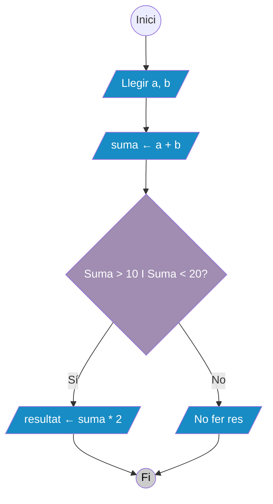
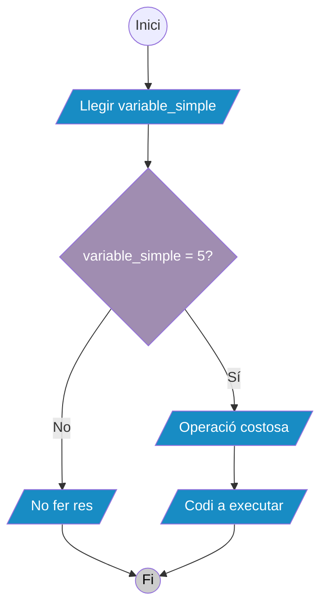
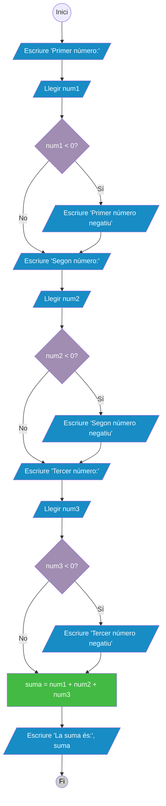
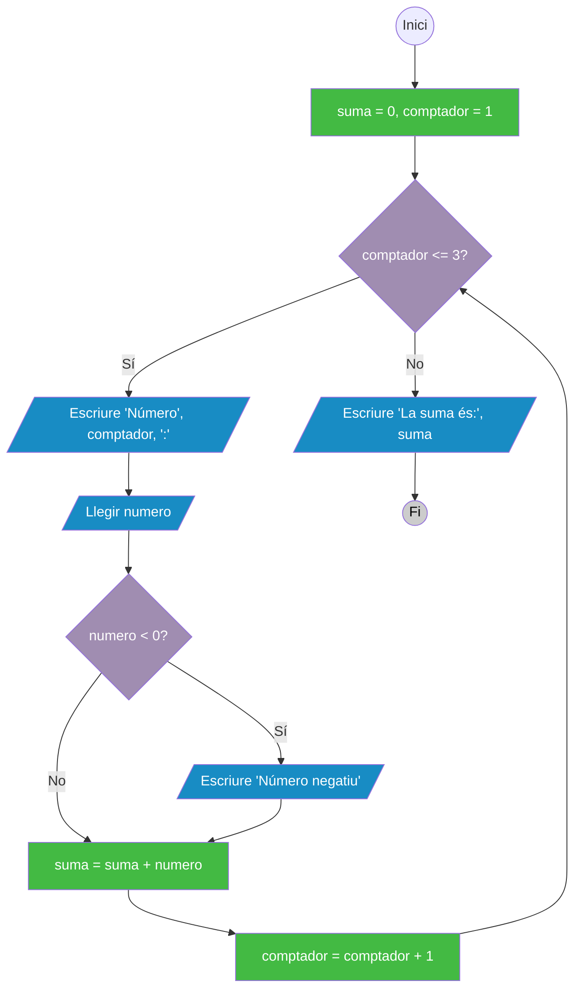

# 5. Casos d'estudi i patrons comuns

En la programació, molts problemes comparteixen patrons similars. Reconèixer aquests patrons ens ajuda a resoldre problemes de manera més eficient i a aplicar solucions provades. En aquesta secció explorarem els patrons més comuns en el disseny d'algoritmes.

## 5.1 Patrons fonamentals en algoritmes

### 5.1.1 Patró d'entrada-processament-sortida

Aquest és el patró més bàsic i es troba en gairebé tots els algoritmes.

#### **Estructura general:**
1. **Entrada**: Obtenir dades de l'usuari o del sistema
2. **Processament**: Realitzar càlculs o transformacions
3. **Sortida**: Mostrar o guardar els resultats

> ***Exemple: Calculadora de superfície***
>
>::: tabs
>== Pseudocodi
>```plaintext
>INICI
>  // ENTRADA
>  ESCRIURE "Introduïu la base:"
>  LLEGIR base
>  ESCRIURE "Introduïu l'altura:"
>  LLEGIR altura
>  
>  // PROCESSAMENT
>  superfície ← base * altura
>  
>  // SORTIDA
>  ESCRIURE "La superfície és: " + superfície
>FI
>```
>== Diagrama de flux
>```mermaid
>graph TD;
>    A((Inici)) --> B[/Escriure "Introduïu la base:"/]:::romboide;
>    B --> C[/Llegir base/]:::romboide;
>    C --> D[/Escriure "Introduïu l'altura:"/]:::romboide;
>    D --> E[/Llegir altura/]:::romboide;
>    E --> F[superficie = base * altura]:::rectangle;
>    F --> G[/Escriure "La superfície és:", superficie/]:::romboide;
>    G --> H((Fi)):::inici_fi;
>
>    classDef romboide fill:#188CC4, color:white;
>    classDef rombe fill:#A08DB1, color:white;
>    classDef rectangle fill:#43BA43, color:white;
>    classDef inici_fi fill:#ccc, color:#000;
>``` 
>:::

#### **Aplicacions del patró:**
- Calculadores
- Convertidors d'unitats
- Sistemes de puntuació
- Processament de dades bàsic

### 5.1.2 Patró de validació d'entrada

Assegura que les dades introduïdes per l'usuari siguen vàlides abans de processar-les.

#### **Estructura general:**
1. Demanar entrada a l'usuari
2. Verificar si l'entrada és vàlida
3. Si no és vàlida, mostrar error i tornar al pas 1
4. Si és vàlida, continuar amb el processament

> ***Exemple: Validar edat***
>
>::: tabs
>== Pseudocodi
>```plaintext
>Inici
>    Repetir
>        Escriure "Introduïu la vostra edat (0-120):"
>        Llegir edat
>        Si edat < 0 O edat > 120 Llavors
>            Escriure "Error: L'edat ha d'estar entre 0 i 120"
>        Fi_Si
>    Mentre edat < 0 O edat > 120
>    
>    Escriure "Edat vàlida:", edat
>Fi
>```
>== Diagrama de flux
>```mermaid
>graph TD;
>    A((Inici)) --> B[/Escriure 'Introduïu edat 0-120'/]:::romboide;
>    B --> C[/Llegir edat/]:::romboide;
>    C --> D{edat < 0 O edat > 120?}:::rombe;
>    D -->|Sí| E[/Escriure 'Error: edat entre 0 i 120'/]:::romboide;
>    D -->|No| F{edat < 0 O edat > 120?}:::rombe;
>    E --> F;
>    F -->|Sí| B;
>    F -->|No| G[/Escriure 'Edat vàlida:', edat/]:::romboide;
>    G --> H((Fi)):::inici_fi;
>
>    classDef romboide fill:#188CC4, color:white;
>    classDef rombe fill:#A08DB1, color:white;
>    classDef rectangle fill:#43BA43, color:white;
>    classDef inici_fi fill:#ccc, color:#000;
>```

### 5.1.3 Patró de cerca

Buscar un element específic dins d'un conjunt de dades.

#### **Cerca seqüencial:**
Es busca element per element fins a trobar-lo o esgotar la llista.

Estructura general:
1. Inicialitzar una variable per controlar si s'ha trobat l'element
2. Iterar sobre cada element de la llista
3. Si l'element coincideix amb el buscat, marcar com trobat
4. Si s'ha trobat, mostrar la posició; si no, indicar que no s'ha trobat

> ***Exemple: Cerca d'un element en una llista***
>::: tabs
>== Pseudocodi
>```plaintext
>INICI
>  trobat ← FALS
>  posició ← 0
>  MENTRE posició < tamany_llista I NO trobat
>    SI element de la llista en posició = element_buscat LLAVORS
>      trobat ← CERT
>    SINÓ
>      posició ← posició + 1
>    FI SI
>  FI MENTRE
>  
>  SI trobat LLAVORS
>    ESCRIURE "Element trobat a la posició: " + posició
>  SINÓ
>    ESCRIURE "Element no trobat"
>  FI SI
>FI
>```
>== Diagrama de flux
>```mermaid
>graph TD;
>    A((Inici)) --> B[/Inicialitzar trobat a FALS, posició a 0/]:::romboide;
>    B --> C{posició < tamany_llista I NO trobat?}
>    C -->|Sí| D[/Si element de la llista en posició = element_buscat/]:::rombe;
>    D -->|Sí| E[/trobat ← CERT/]:::romboide;
>    D -->|No| F[/posició ← posició + 1/]:::romboide;
>    C -->|No| G{trobat?}:::rombe;
>    E --> G;
>    F --> C;
>    G -->|Sí| H[/Escriure 'Element trobat a la posició:', posició/]:::romboide;
>    G -->|No| I[/Escriure 'Element no trobat'/]
>    H --> J((Fi)):::inici_fi;
>    I --> J;
>    J --> K((Fi)):::inici_fi;
>
>    classDef romboide fill:#188CC4, color:white;
>    classDef rombe fill:#A08DB1, color:white;
>    classDef rectangle fill:#43BA43, color:white;
>    classDef inici_fi fill:#ccc, color:#000;
>```
>:::

### 5.1.4 Patró d'acumulació

Utilitzat per calcular sumes, mitjanes, o anar acumulant valors.

Estructura general:
1. Inicialitzar una variable acumuladora a zero
2. Iterar sobre una llista d'elements
3. Per cada element, sumar-lo a l'acumulador
4. Mostrar el resultat final

> ***Exemple: Calcular mitjana de notes***
>
>::: tabs
>== Pseudocodi
> ```plaintext
> INICI
>   suma ← 0
>   comptador ← 0
>   
>   REPETIR
>     ESCRIURE "Introduïu una nota (o -1 per acabar):"
>     LLEGIR nota
>     SI nota != -1 LLAVORS
>       suma ← suma + nota
>       comptador ← comptador + 1
>     FI SI
>   MENTRE nota != -1
>   
>   SI comptador > 0 LLAVORS
>     mitjana ← suma / comptador
>     ESCRIURE "La mitjana és: " + mitjana
>   SINÓ
>     ESCRIURE "No s'han introduït notes"
>   FI SI
> FI
> ```
>== Diagrama de flux
>```mermaid
>graph TD;
>    A((Inici)) --> B[/Inicialitzar suma a 0, comptador a 0/]:::romboide;
>    B --> C[/Escriure 'Introduïu una nota o -1 per acabar:'/]:::romboide;
>    C --> D[/Llegir nota/]:::romboide;
>    D --> E{nota != -1?}:::rombe;
>    E -->|Sí| F[/suma ← suma + nota/]:::romboide;
>    F --> G[/comptador ← comptador + 1/]:::romboide;
>    G --> C;
>    E -->|No| H{comptador > 0?}:::rombe;
>    H -->|Sí| I[/mitjana ← suma / comptador/]:::romboide;
>    I --> J[/Escriure 'La mitjana és:', mitjana/]:::romboide;
>    H -->|No| K[/Escriure 'No s\'han introduït notes'/]:::romboide;
>    J --> L((Fi)):::inici_fi;
>    K --> L;
>    L --> M((Fi)):::inici_fi;
>
>    classDef romboide fill:#188CC4, color:white;
>    classDef rombe fill:#A08DB1, color:white;
>    classDef rectangle fill:#43BA43, color:white;
>    classDef inici_fi fill:#ccc, color:#000;
>```
>:::

## 5.2 Optimització de patrons comuns

### 5.2.1 Principis d'optimització

#### **Evitar càlculs redundants**

::: tabs
== Pseudocodi
```plaintext
// Dolent: Calcular el mateix valor múltiples vegades
SI (a + b) > 10 I (a + b) < 20 LLAVORS
  resultat ← (a + b) * 2
FI SI

// Bo: Calcular una vegada i reutilitzar
suma ← a + b
SI suma > 10 I suma < 20 LLAVORS
  resultat ← suma * 2
FI SI
```
== Diagrama de flux

:::

#### **Usar condicions eficients**
::: tabs
== Pseudocodi
```plaintext
// Dolent: Comprovar condicions costoses primer
SI operació_costosa() I variable_simple = 5 LLAVORS
  // codi
FI SI

// Bo: Comprovar condicions simples primer
SI variable_simple = 5 I operació_costosa() LLAVORS
  // codi
FI SI
```
== Diagrama de flux

:::

### 5.2.2 Refactorització de patrons

#### **Abans de refactoritzar:**
::: tabs
== Pseudocodi
```plaintext
INICI
  ESCRIURE "Introduïu el primer número:"
  LLEGIR num1
  SI num1 < 0 LLAVORS
    ESCRIURE "El primer número és negatiu"
  FI SI
  
  ESCRIURE "Introduïu el segon número:"
  LLEGIR num2
  SI num2 < 0 LLAVORS
    ESCRIURE "El segon número és negatiu"
  FI SI
  
  ESCRIURE "Introduïu el tercer número:"
  LLEGIR num3
  SI num3 < 0 LLAVORS
    ESCRIURE "El tercer número és negatiu"
  FI SI
  
  suma = num1 + num2 + num3
  ESCRIURE "La suma és:", suma
FI
```
== Diagrama de flux

:::

#### **Després de refactoritzar:**
::: tabs
== Pseudocodi
```plaintext
INICI
  suma = 0
  comptador = 1
  
  Mentre comptador <= 3 Fer
    Escriure "Introduïu el número", comptador, ":"
    Llegir numero
    
    Si numero < 0 Llavors
      Escriure "El número", comptador, "és negatiu"
    Fi_Si
    
    suma = suma + numero
    comptador = comptador + 1
  Fi_Mentre
  
  Escriure "La suma és:", suma
Fi
```
== Diagrama de flux

:::

::: tip Conceptes clau per recordar
- Els **patrons comuns** apareixen repetidament en diferents problemes
- Reconèixer patrons **estalvia temps** i reduce errors
- La **validació d'entrada** és crucial en aplicacions reals
- Els **casos d'estudi** ens ajuden a entendre aplicacions pràctiques
- La **refactorització** millora la qualitat i mantenibilitat del codi
- Cada sector té els seus **patrons específics** però els fonamentals són universals
- L'**optimització** és important però no ha de comprometre la claredat del codi
:::